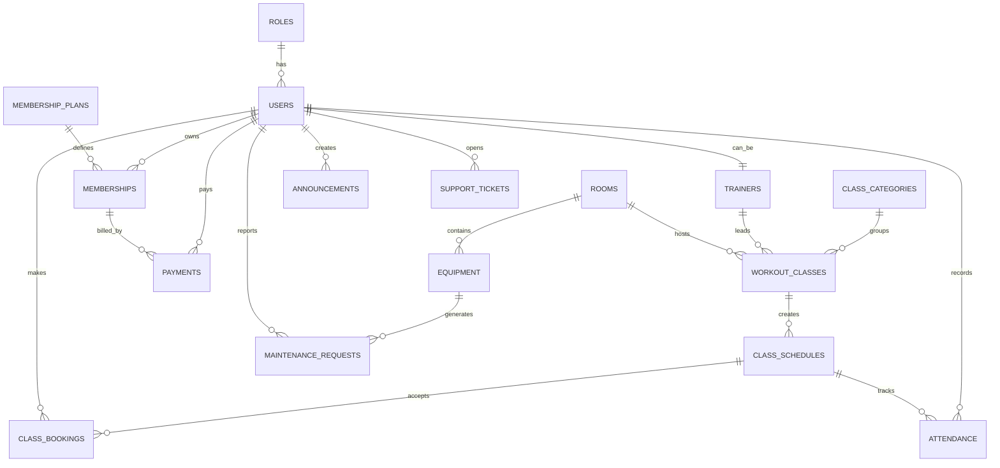

# Schema bazei de date

## Tabele si relatii

## Chei primare si chei straine importante

- `users.role_id -> roles.role_id`
- `memberships.user_id -> users.user_id`
- `memberships.plan_id -> membership_plans.plan_id`
- `trainers.user_id -> users.user_id`
- `workout_classes.category_id -> class_categories.category_id`
- `workout_classes.trainer_id -> trainers.trainer_id`
- `workout_classes.room_id -> rooms.room_id`
- `class_schedules.class_id -> workout_classes.class_id`
- `class_bookings.schedule_id -> class_schedules.schedule_id`
- `class_bookings.user_id -> users.user_id`
- `payments.membership_id -> memberships.membership_id`
- `attendance.schedule_id -> class_schedules.schedule_id`
- `equipment.room_id -> rooms.room_id`
- `maintenance_requests.equipment_id -> equipment.equipment_id`
- `support_tickets.user_id -> users.user_id`

## Explicatie scurta

- `roles` si `users` gestioneaza autentificarea si drepturile.
- `membership_plans` si `memberships` definesc abonamentele disponibile si cele cumparate de membri.
- `trainers`, `rooms`, `class_categories`, `workout_classes` si `class_schedules` descriu activitatea salii.
- `class_bookings` si `attendance` urmaresc rezervarile si prezenta.
- `payments` gestioneaza tranzactiile pentru abonamente.
- `equipment` si `maintenance_requests` acopera partea operationala a clubului.
- `announcements` si `support_tickets` acopera comunicarea dintre club si membri.

## Ce poti arata la prezentare

1. schema vizuala de mai sus;
2. fisierul `database/schema.sql`;
3. explicatia relatiilor dintre `users`, `memberships`, `class_schedules`, `class_bookings` si `payments`.
